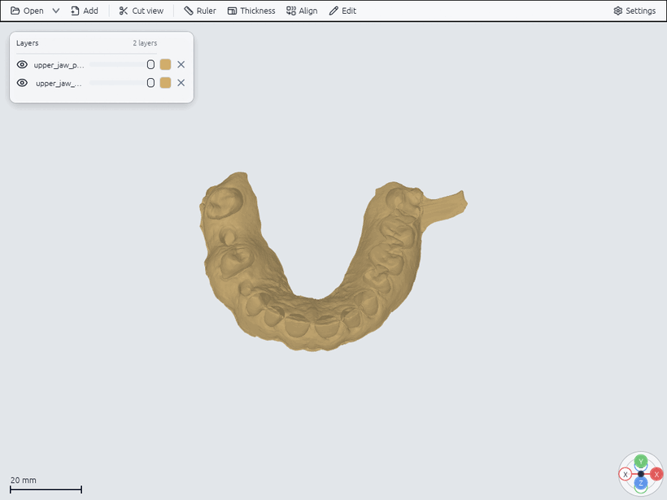
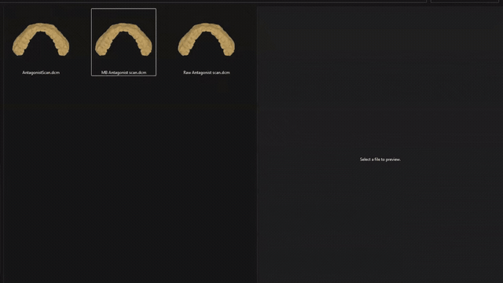
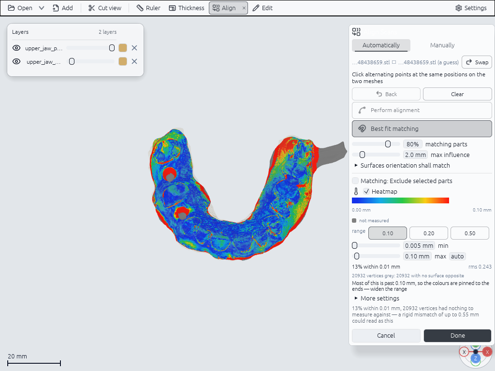
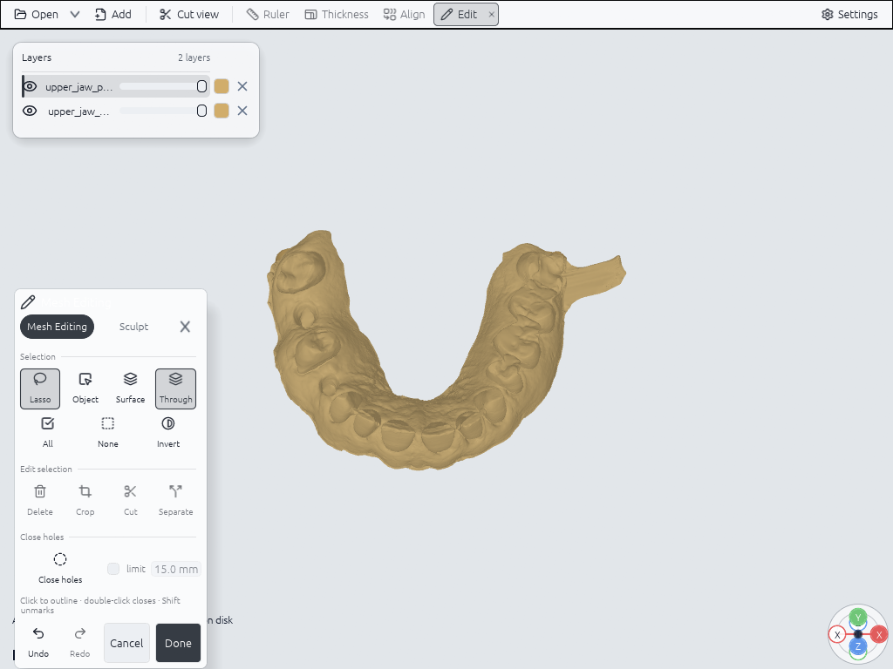
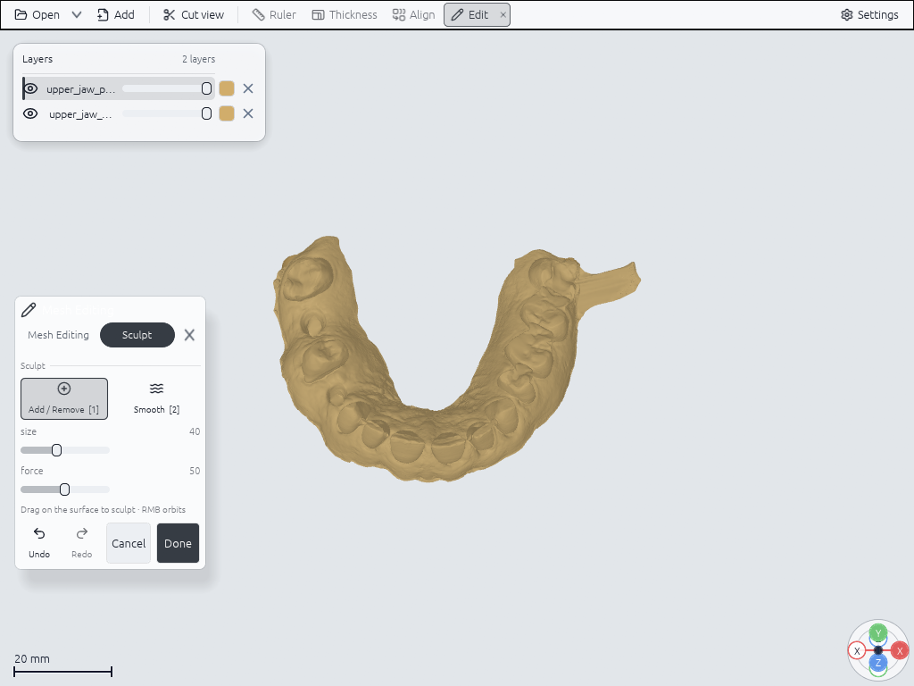
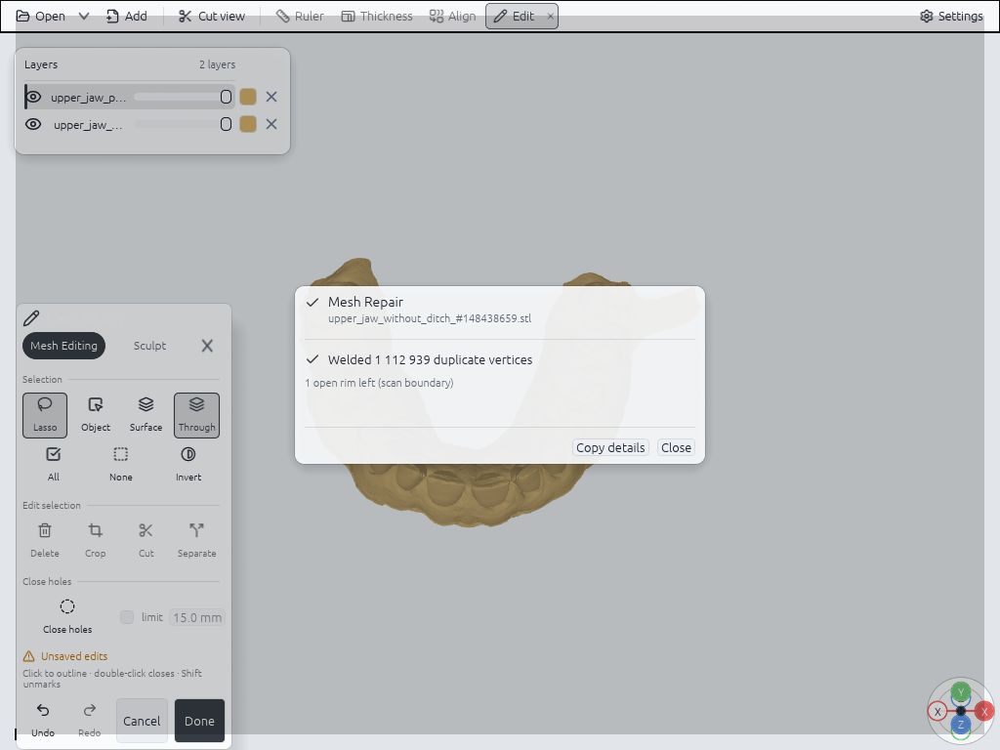
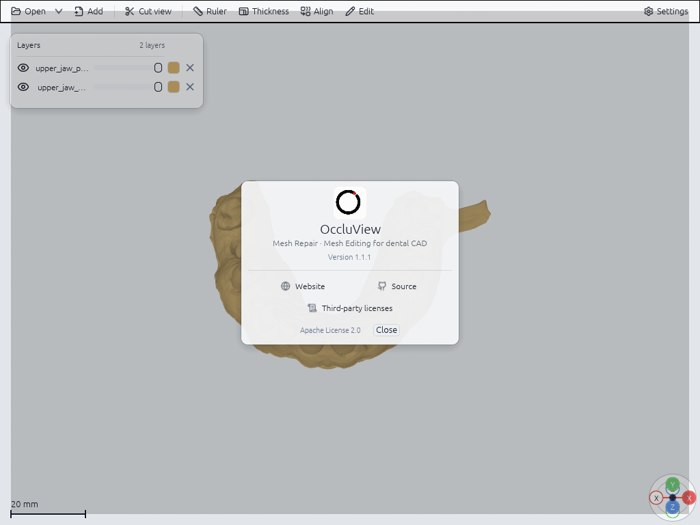

<table align="center">
  <tr>
    <td valign="middle"></td>
    <td valign="middle">
      <h1>OccluView</h1>
      <p><strong>Advanced Mesh Repair and Mesh Editing for digital dental CAD.</strong></p>
      <p>
        <a href="https://github.com/occlutrace/OccluView/releases/tag/v1.1.1">Latest published release: v1.1.1</a>
        &nbsp;·&nbsp;
        <a href="https://github.com/occlutrace/OccluView/actions/workflows/ci.yml">Build status</a>
      </p>
    </td>
  </tr>
</table>

OccluView is a native desktop dental CAD workspace for inspecting, aligning,
editing, repairing, and exporting scan meshes. It is designed for the work
that starts after a scan opens: compare two surfaces, find the deviation,
repair unsafe topology, edit a selected region, and keep the result traceable.

## The workflow at a glance

<p align="center">
  
</p>

The animation and screenshots below were captured headlessly from the release
binary using two supplied, de-identified STL scans. The visible identifiers are
numeric only; no patient name is included.

## Download for Windows

Choose one file:

- [OccluView-Windows-Setup.msi](https://github.com/occlutrace/OccluView/releases/latest/download/OccluView-Windows-Setup.msi) — recommended; installs the viewer, Explorer previews, thumbnails, and file associations.
- [OccluView-Windows-Portable.zip](https://github.com/occlutrace/OccluView/releases/latest/download/OccluView-Windows-Portable.zip) — runs without installation; no Explorer integration.

## Quick Look

OccluView adds a live 3D preview to Windows Explorer. Select a scan and inspect
it immediately without opening the full viewer.

<p align="center">
  
</p>

## Alignment and Heatmap

<p align="center">
  
</p>

Open both scans as layers, choose **A** (Align), and use the automatic workflow:

1. Confirm the moving and fixed scan in the panel.
2. Click `Best fit matching` to seat corresponding surfaces.
3. Read the colour map with the explicit millimetre legend, range presets, and
   measured statistics.

The Heatmap is not a decorative overlay: the panel reports how much surface was
measured, what fell outside the opposing scan, the selected tolerance/range,
and when the current range is saturating. Manual alignment remains available
when the automatic pair is not appropriate.

## Mesh Editing

<p align="center">
  
</p>

Mesh Editing keeps the common dental CAD operations in one bounded palette:

- lasso, object, surface, and through-mesh selection;
- select all, clear, and invert;
- delete, crop, cut, separate, and close safe holes;
- undo, redo, cancel, and an explicit Done commit.

<p align="center">
  
</p>

Sculpting uses the same editor session. Add/Remove and Smooth are separate
brush modes, while the size and force controls stay compact and readable in the
panel instead of consuming the whole viewport.

## Mesh Repair

<p align="center">
  
</p>

Mesh Repair runs on the selected layer and opens a bounded report card. It
removes duplicate and degenerate geometry, repairs unsafe topology, closes only
safe pinholes, and reports the non-zero changes together with remaining open
rims. A clean mesh receives an explicit “nothing to repair” result rather than
silence. `Copy details` preserves the full per-pass report for a case record.

## Product information surface

<p align="center">
  
</p>

About, third-party notices, and repair results use the same centered modal
surface. The backdrop is kept separate from the measured card, so opening About
does not trigger a resize/repaint loop or leave a tall empty window.

## Files and results

Open STL, PLY, OBJ, GLB, and HPS dental containers. Export the finished result
as STL, PLY, or OBJ.

- `.hps` and `.dcm` are accepted as HPS dental containers; medical DICOM is not supported (a `DICM` signature is refused).

## Controls

Use the **Help** button in the toolbar for the complete keyboard and mouse reference.

- Open a scan with **Ctrl+O**. Opening another file adds a layer; toolbar Open
  replaces the scene.
- Toolbar tools: **C** Cut View, **M** Ruler, **T** Thickness, **A** Align, and
  **E** Mesh Editing.
- Orbit with right-drag; pan with middle-drag or LMB+RMB drag; zoom toward the
  pointer with the wheel; recenter on a surface with middle-click or
  double-click.
- In Mesh Editing, **Ctrl+A** selects all; **Delete** or **Backspace** removes;
  **Ctrl+Z**, **Ctrl+Y**, or **Ctrl+Shift+Z** undo and redo; **Enter** closes an
  outline; **Esc** cancels it.
- Mesh Repair is available from a layer's context menu and reports exactly what
  changed.
- In Sculpt, **1** chooses Add/Remove and **2** chooses Smooth. **Shift+wheel** changes Sculpt brush size; **Ctrl+wheel** changes Sculpt brush intensity.
  Holding **Shift** during a drag removes or strengthens the active brush mode.
- In Align, **Shift** erases an Align exclusion region; **Ctrl/Command+drag** rotates a scan in Align Manual mode; stationary **RMB click** undoes the last alignment point.
- **Ctrl+Middle-click** hides a layer; **Ctrl+Shift+Middle-click** restores the
  last hidden layer; **Shift+Middle-click** toggles translucency.
- The bottom-right axis triad follows the camera and snaps to a labeled axis
  when an endpoint is clicked.

## The cut view

Plant the disc on a surface, then drag it to position the section. Plain wheel
zooms the panel; **Ctrl+wheel** changes disc size. **F** flips the kept half while the disc is planted. **Esc** unplants the disc or closes Cut View.

## Windows Explorer

The MSI registers thumbnails and an interactive Preview Pane. In that pane,
right-drag orbits, wheel zooms, **F** frames the model, and **W** toggles wireframe.

## Command line

```text
occluview-cli thumbnail <file> [-o out.png] [--size N]
occluview-cli convert <file> -o output.{stl|ply|obj}
occluview-cli close-holes <file> -o out.stl [--limit-mm N]
occluview-cli info <file> [file...]
```

`thumbnail` uses the same rendering path as the Windows Preview Pane.

Licensed under [Apache-2.0](LICENSE); distribution notices are in [NOTICE](NOTICE)
and [THIRD-PARTY-NOTICES.md](THIRD-PARTY-NOTICES.md).
